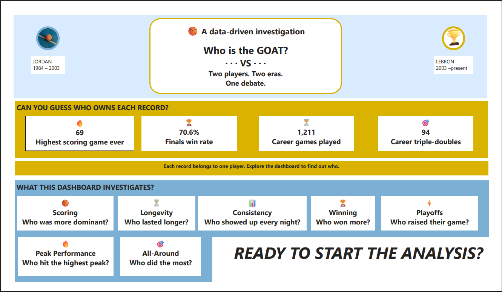
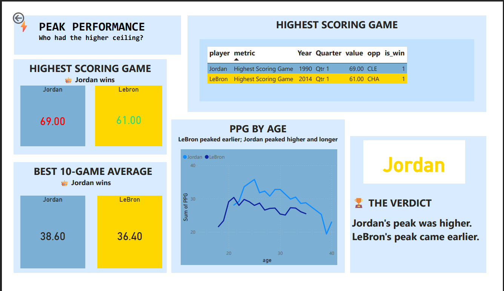
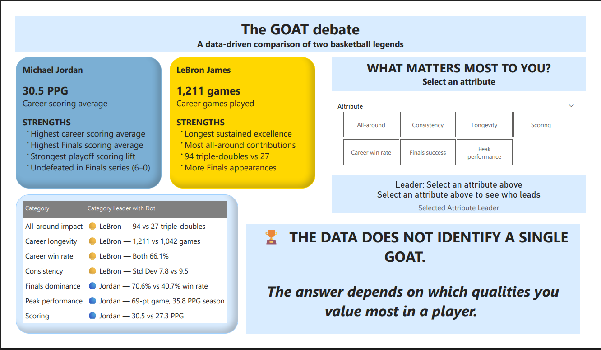

# Phase 8: Dashboard Development

## Overview

The dashboard consists of 8 pages designed to take the viewer on a journey from curiosity to conclusion. Each page answers one of the 7 core questions, with Page 1 serving as the hook and Page 8 as the final verdict.

---

## Dashboard Pages

| Page | Title | Purpose |
|------|-------|---------|
| 1 | The Debate | Hook viewer with mystery stats and questions |
| 2 | Scoring Comparison | Answer Q1: Who scores more per game? |
| 3 | Longevity | Answer Q2: Who played longer? |
| 4 | Winning Impact | Answer Q3: Who wins more? |
| 5 | Consistency | Answer Q4: Who is more reliable night-to-night? |
| 6 | Playoff Performance | Answer Q5: Who rises in the playoffs? |
| 7 | Peak Performance | Answer Q6: Who had the higher ceiling? |
| 8 | Final Verdict | Present neutral conclusion based on evidence |

---

## Page 1: The Debate (Hook Page)

### Design Concept

The first page is designed as a teaser - like a movie trailer - to create curiosity and encourage exploration.

### Key Elements

| Element | Content |
|---------|---------|
| Header | "A data-driven investigation" |
| Main Title | "Who is the GOAT?" |
| Player Timelines | Jordan (1984-2003) vs LeBron (2003-present) |
| Tagline | "Two players. Two eras. One debate." |
| Teaser Section | "CAN YOU GUESS WHO OWNS EACH RECORD?" |
| Mystery Stats | 69 points, 70.6%, 1,211 games, 94 triple-doubles |
| Categories | 7 investigation categories with questions |
| Call to Action | "READY TO START THE ANALYSIS?" button |

### Screenshot

### Interactive Features

| Feature | Purpose |
|---------|---------|
| Navigation Button | Jumps to detailed analysis (Page 2) |
| Mystery Stats | No player names - creates curiosity |

---

## Page 2: Scoring Comparison

### Purpose

Answer Question 1: Who scores more per game?

### Key Visuals

- Side-by-side KPI cards (Jordan 30.5 PPG vs LeBron 27.3 PPG)
- Regular vs Playoff PPG comparison chart
- Season-by-season PPG trend line
- Playoff lift comparison (+3.0 vs +1.6)

### Key Insights

- Jordan averages 3.2 more points per game
- Jordan's playoff lift is nearly double LeBron's
- Jordan has 173 games with 40+ points (16.6% vs LeBron's 5.4%)

---

## Page 3: Longevity

### Purpose

Answer Question 2: Who played longer?

### Key Visuals

- Total games comparison (1,042 vs 1,211)
- Total minutes comparison (40,061 vs 46,619)
- Cumulative games line chart
- Average minutes per game (38.4 vs 38.5)

### Key Insights

- LeBron played 169 more games (2+ extra seasons)
- LeBron played 6,558 more minutes (136 additional full games)
- Nearly identical average minutes per game (38.4 vs 38.5)

---

## Page 4: Winning Impact

### Purpose

Answer Question 3: Who wins more?

### Key Visuals

- Two gauges showing identical 66.1% win rate
- Win % by opponent strength matrix
- Home vs away win percentage

### Key Insights

- **Most remarkable finding:** Both have identical 66.1% career win percentage
- Both dominate above-.500 teams (66.6-66.8%)
- Both struggle against below-.500 teams (43.8-45.8%)

---

## Page 5: Consistency

### Purpose

Answer Question 4: Who is more reliable night-to-night?

### Key Visuals

- Standard deviation comparison (9.5 vs 7.8)
- Bad games % (under 15 points: 4.1% vs 3.8%)
- Great games % (40+ points: 16.6% vs 5.4%)
- Typical games % (20-30 points: 38.4% vs 50.0%)
- Triple-double comparison (27 vs 94)

### Key Insights

- LeBron is more consistent (lower variance, more typical games)
- Jordan has 3x more great games (40+ points)
- LeBron has 3.5x more triple-doubles

---

## Page 6: Playoff Performance

### Purpose

Answer Question 5: Who rises in the playoffs?

### Key Visuals

- Finals win % gauges (70.6% vs 40.7%)
- Finals PPG comparison (33.9 vs 28.6)
- Playoff lift by season line chart
- Game 6 and Game 7 performance comparison

### Key Insights

- **Largest gap between players:** Finals win % (70.6% vs 40.7%)
- Jordan's best playoff lift: +11.5 PPG (1986)
- LeBron's best playoff lift: +6.8 PPG (2018)
- Jordan never lost a Finals series (6-0)

---

## Page 7: Peak Performance

### Purpose

Answer Question 6: Who had the higher ceiling?

### Key Visuals

- Highest scoring game (69 vs 61)
- Best 10-game average (38.6 vs 36.4)
- Top 5 scoring games table
- PPG by age line chart
- Peak season highlights

### Key Insights

- Jordan's peak is clearly higher
- Jordan peaked at age 24-25, LeBron at age 21
- Jordan had 4 seasons at 32+ PPG; LeBron had 0

### Screenshot

---

## Page 8: Final Verdict

### Purpose

Present neutral, evidence-based conclusion without forcing a winner.

### Key Visuals

- Category leaders summary (7 categories)
- Jordan's strengths bullet points
- LeBron's strengths bullet points
- Shared achievements (66.1% win rate)
- Neutral verdict text
- Interactive slicer for "What Matters Most to You?"

### Verdict Text

> The data does not identify a single GOAT.
>
> If you prioritize scoring dominance, peak performance, and Finals success → the evidence favors JORDAN.
>
> If you prioritize longevity, consistency, and all-around contribution → the evidence favors LEBRON.
>
> The answer depends on which qualities you value most in a player.

### Screenshot

---

## Interactive Features

### Navigation

- "START THE ANALYSIS" button on Page 1 navigates to Page 2
- Page tabs at bottom for direct navigation

### What-If Parameters (Page 8)

Users can adjust sliders for 7 categories to see which player wins based on their personal values.

### Dynamic Slicer (Page 8)

Users can select an attribute from the slicer to see the leader and reason dynamically.

---

## Color Scheme

| Element | Color | Hex Code |
|---------|-------|----------|
| Jordan | Red | #CE1141 |
| LeBron | Purple | #552583 |
| Tie | Gray | #6C757D |
| Header | Dark Blue | #1E3A5F |

---

## Technical Implementation

### Data Source

All visuals connect to 10 SQL views created in Phase 6.

### DAX Measures

90+ measures created in Phase 7 power the visuals, including:
- Lookup measures (Jordan PPG, LeBron Games, etc.)
- KPI Leader measures (Scoring Leader, Playoff Leader, etc.)
- Dynamic text measures
- Weighted GOAT score measures

### Navigation

Bookmarks and page navigation buttons enable smooth exploration.

---

## Next Steps

Proceed to **Phase 9: Insights & Recommendations** for final documentation.